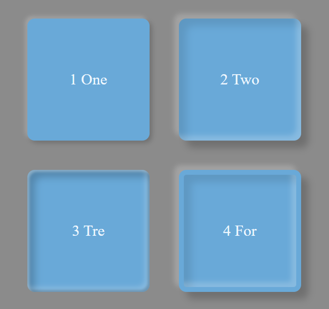

# box-shadow

> Code-Box-Shadow

.container .box.shadow1 {
    box-shadow: -5px -5px 8px rgba(255, 255, 255, 0.2),
        5px 5px 10px rgba(0, 0, 0, 0.2);
}

.container .box.shadow2 {
    box-shadow: -10px -10px 10px rgba(255, 255, 255, 0.2),
        15px 15px 15px rgba(0, 0, 0, 0.2),
        inset -10px -10px 10px rgba(255, 255, 255, 0.2),
        inset 15px 15px 15px rgba(0, 0, 0, 0.1);
}

.container .box.shadow3 {
    box-shadow: inset 4px 4px 5px rgba(255, 255, 255, 0.3),
        inset -4px -4px 5px rgba(0, 0, 0, 0.2),
        inset -10px -10px 10px rgba(255, 255, 255, 0.2),
        inset 15px 15px 15px rgba(0, 0, 0, 0.2);
}

.container .box.shadow4 {
    border: 10px solid #69a9d8;
    box-shadow: -10px -10px 10px rgba(255, 255, 255, 0.2),
        15px 15px 15px rgba(0, 0, 0, 0.2),
        inset -10px -10px 10px rgba(255, 255, 255, 0.2),
        inset 15px 15px 15px rgba(0, 0, 0, 0.1);
}
